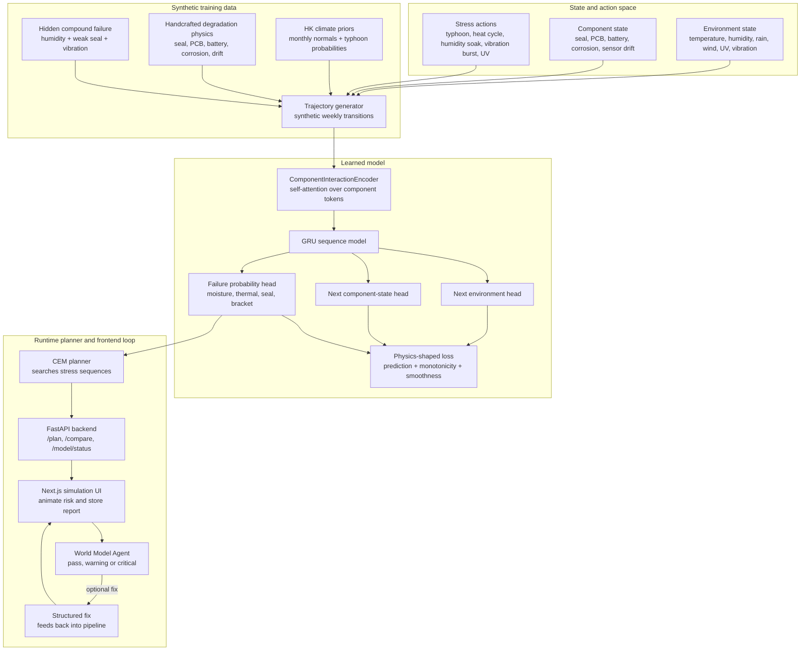
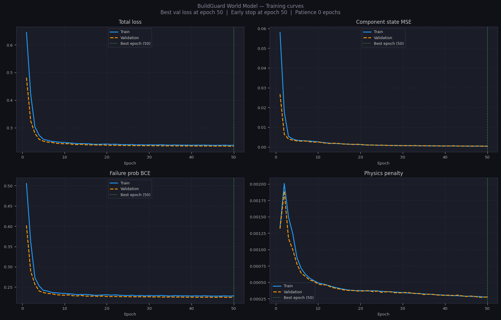

# Manu

Manu is a hackathon prototype for turning dense-city hardware needs into reviewable smart-city device briefs.

It takes a prompt such as an aging-building monitoring need, extracts deployment context, selects catalog-backed components, builds a BOM, identifies manufacturability risks, renders a procedural 3D node, runs a field-risk world-model simulation, and prepares a sourcing/RFQ handoff.

The current demo is **BuildGuard Node**, a facade-mounted sensing node for aging Hong Kong residential buildings.

## What Manu Does

Manu is a first-mile hardware brief generator for smart-city nodes:

```text
problem prompt
  -> context gate
  -> multi-agent pipeline
  -> component graph
  -> BOM
  -> DfMA risk checkpoint
  -> 3D scene graph
  -> world-model field-risk simulation
  -> Build Pack sourcing handoff
```

Manu does not generate final CAD, certify structural safety, replace registered inspectors, or produce guaranteed live supplier quotes. It produces an auditable prototype brief that a hardware engineer, operator or supplier can review.

## Repository Layout

```text
.
├── frontend/                 Next.js app, local MCP servers, pipeline logic and tests
│   ├── app/                  App Router pages and API routes
│   ├── components/           Workspace, 3D scene, chat, marketplace and shared UI
│   ├── data/                 Checked-in catalog, rules, supplier graph and demo fixture
│   ├── lib/                  Pipeline, MCP client, store, exports and world-model bridge
│   ├── mcp/                  Local stdio MCP servers used by the app
│   └── __tests__/            Vitest coverage for pipeline, UI, MCP and APIs
├── backend/                  FastAPI world-model backend and synthetic training code
├── docs/                     Product, demo, architecture and truth-policy notes
└── README.md                 Repo-level setup, architecture and limitations
```

Important deeper docs:

- [Frontend README](frontend/README.md) - detailed runtime architecture, API map and test matrix.
- [Multi-agent pipeline](docs/multi-agent-pipeline.md) - agent/MCP ownership and pipeline contracts.
- [Runtime/defaults audit](docs/runtime-and-defaults-audit.md) - hardcoded data, fallbacks and truth boundaries.
- [World model notes](docs/worldmodel.md) - simulation scope and expansion map.
- [BuildGuard demo](docs/buildguard-node.md) - demo object, BOM, risk and fix narrative.

## Quick Start

Install and run the frontend:

```bash
cd frontend
npm install
npm run dev
```

Open:

```text
http://localhost:3000
```

The app starts on the project menu. Create a project, enter a hardware prompt, then continue into the workspace.

Run checks:

```bash
cd frontend
npm test
npm run lint
npm run build
```

## Environment

Create `frontend/.env.local` when running the full demo:

```bash
OPENAI_API_KEY=...
OPENAI_MODEL=gpt-4.1-mini
TAVILY_API_KEY=...
WORLD_MODEL_API_URL=http://127.0.0.1:8000
```

Current behavior:

- `OPENAI_API_KEY` enables the LLM context, component, scene, intent and RFQ agents. The app still has deterministic parser/rule fallbacks for supported paths.
- `OPENAI_MODEL` defaults to `gpt-4.1-mini`.
- `TAVILY_API_KEY` enables live candidate source research through the source-research MCP. Without it, sourcing refresh returns `not_configured`.
- `WORLD_MODEL_API_URL` defaults to `http://127.0.0.1:8000`.

The frontend route `/api/world-model/plan` will try to auto-start the backend with `uv run uvicorn main:app --host 0.0.0.0 --port 8000` from `backend/` if the backend is not already reachable.

## Backend

The backend is a FastAPI service for the BuildGuard world model.

```bash
cd backend
uv sync
uv run uvicorn main:app --host 0.0.0.0 --port 8000
```

Main endpoints:

- `GET /health`
- `POST /plan`
- `POST /compare`
- `GET /demo/compare`
- `GET /model/status`
- `WebSocket /ws/stress-test`

The checked-in `backend/world_model.pt` keeps the demo from retraining on first run. If that file is removed, `backend/training.py` can train a new model and regenerate training artifacts.

## Runtime Architecture

```mermaid
flowchart LR
  User["Urban operator / founder<br/>dense-city hardware need"] --> Home["Project menu<br/>/"]
  Home --> Entry["Context entry<br/>/project/[id]"]
  Entry --> GateAPI["/api/context/analyze"]
  GateAPI --> Gate{"Context Gate<br/>ready?"}
  Gate -->|missing context| Questions["Targeted questions"]
  Questions --> Entry
  Gate -->|ready canonical prompt| StreamAPI["/api/pipeline/generate<br/>SSE stages"]

  StreamAPI --> Orchestrator["Pipeline Orchestrator<br/>state machine + checkpoints"]
  Orchestrator --> Runtime["Agent Runtime<br/>trace, max steps, tool allowlist"]

  subgraph Agents["Specialist agents and deterministic resolvers"]
    direction TB
    Context["Context Agent<br/>DeploymentContext"]
    Compliance["Compliance Agent"]
    Components["Component Agent<br/>catalog ids + candidate extras"]
    Hardware["Hardware Expert<br/>assembly pattern"]
    BOM["BOM Resolver<br/>catalog and registry prices"]
    DFMA["DfMA Engine<br/>risk and fix packs"]
    Supplier["Supplier/RFQ Agent"]
    Scene["3D Scene Agent<br/>procedural scene graph"]
  end

  Runtime --> Context --> Compliance --> Components --> Hardware --> BOM --> DFMA
  DFMA -->|critical warning| Checkpoint["Risk checkpoint<br/>awaiting user decision"]
  Checkpoint --> Workspace["Workspace<br/>/project/[id]/workspace"]
  Workspace -->|apply fix| FixAPI["/api/pipeline/apply-fix"]
  FixAPI --> Orchestrator
  DFMA -->|no blocker or fixed| Supplier --> Scene --> State["PipelineState<br/>single contract"]

  State --> Store["Zustand store<br/>hydrated UI state"]
  Store --> Left["Left panel<br/>context, BOM, suppliers, sources"]
  Store --> Center["Center panel<br/>3D node and simulation reports"]
  Store --> Right["Right panel<br/>chat, trace, warnings, verdicts"]
  Store --> Market["Build Pack<br/>/project/[id]/marketplace"]
  Market --> Exports["PDF readiness pack<br/>BOM CSV<br/>Design JSON"]
  Market --> Research["/api/research/refresh<br/>candidate evidence"]
  Market --> Redirect["/api/go<br/>allowlisted sourcing links"]

  subgraph MCP["Local stdio MCP servers"]
    direction TB
    ComplianceMCP["compliance MCP<br/>rules + source metadata"]
    HardwareMCP["hardware MCP<br/>catalog search + recommendations"]
    SupplierMCP["supplier MCP<br/>GBA/generic route"]
    SceneMCP["scene MCP<br/>catalog scene graph"]
    SourceMCP["source research MCP<br/>Tavily candidates"]
  end

  Compliance -.-> ComplianceMCP
  Components -.-> HardwareMCP
  Hardware -.-> HardwareMCP
  Supplier -.-> SupplierMCP
  Scene -.-> SceneMCP
  Research -.-> SourceMCP

  subgraph Data["Checked-in grounding data"]
    direction TB
    Catalog["component-catalog.json<br/>123 components"]
    Selection["component-selection-rules.json"]
    Registry["parts-registry.json<br/>48 registry entries"]
    Rules["compliance-rules.json<br/>dfma-rules.json"]
    Assembly["assembly-patterns.json"]
    Suppliers["supplier-graph.json"]
  end

  HardwareMCP --> Catalog
  HardwareMCP --> Selection
  BOM --> Catalog
  BOM --> Registry
  ComplianceMCP --> Rules
  DFMA --> Rules
  Hardware --> Assembly
  SupplierMCP --> Suppliers

  Center --> WMPlan["/api/world-model/plan"]
  WMPlan --> WMBackend["FastAPI world-model backend<br/>backend/"]
  WMBackend --> WMAnalyze["/api/world-model/analyze"]
  WMAnalyze --> Right
```



The central contract is `PipelineState` in `frontend/lib/pipeline/types.ts`. It is produced by the orchestrator, hydrated into the Zustand store, reused by the marketplace, exported as PDF/CSV/JSON, and passed into world-model flows.

## World Model Architecture

The world model is a narrow learned stress-test layer for the BuildGuard facade-node object family. It is useful for the demo because it can search for compound field-risk sequences, but it is not certified structural analysis and it is not trained on deployed BuildGuard failures.



### Training Curves



## Agents and MCP Servers

The agent runtime is in `frontend/lib/pipeline/agent-runtime.ts`. It records trace events, tracks MCP calls, enforces max steps, and checks that agents only call allowlisted tools from `frontend/lib/pipeline/agent-registry.ts`.

| Stage | Code | Tooling |
|---|---|---|
| Context Gate | `frontend/lib/context-gate*.ts` | OpenAI JSON agent or deterministic gate |
| Context Agent | `frontend/lib/pipeline/context-agent.ts` | OpenAI or prompt parser |
| Compliance | `frontend/mcp/compliance-server.mjs` | HK requirement lookup from checked-in rules |
| Components | `frontend/lib/pipeline/component-agent.ts` | OpenAI with Hardware MCP shortlist |
| Hardware | `frontend/mcp/hardware-server.mjs` | catalog search, recommendations and assembly matching |
| BOM | `frontend/lib/pipeline/bom-resolver.ts` | checked-in catalog and parts registry |
| DfMA | `frontend/lib/pipeline/dfma-engine.ts` | deterministic manufacturability rules |
| Supplier/RFQ | `frontend/mcp/supplier-server.mjs` | GBA/generic routing and RFQ questions |
| Scene | `frontend/mcp/scene-server.mjs` | procedural scene graph for catalog components |
| Source research | `frontend/mcp/source-research-server.mjs` | Tavily candidate research when configured |

## Data Model

Checked-in data is intentionally part of the prototype:

| File | Purpose |
|---|---|
| `frontend/data/component-catalog.json` | 123 smart-city components with tags, costs, scene metadata and source status |
| `frontend/data/component-selection-rules.json` | deterministic prompt-to-component intent rules |
| `frontend/data/parts-registry.json` | 48 manufacturer/MPN/lifecycle/source entries and distributor search links |
| `frontend/data/supplier-graph.json` | GBA and generic supplier routing templates |
| `frontend/data/assembly-patterns.json` | assembly matching and required-part checks |
| `frontend/data/dfma-rules.json` | manufacturability warnings and fix packs |
| `frontend/data/compliance-rules.json` | seeded compliance requirements and source metadata |
| `frontend/data/demo-object.json` | canonical BuildGuard demo fixture generated by `frontend/scripts/export-demo-object.mjs` |

Candidate web research does not mutate these files automatically. It is surfaced for human review before anything becomes trusted catalog data.

## Product Surfaces

| Route | Role |
|---|---|
| `/` | Project menu |
| `/project/[id]` | Context entry form |
| `/project/[id]/workspace` | Main chat, trace, BOM, DfMA, 3D and world-model workspace |
| `/project/[id]/marketplace` | Build Pack sourcing, RFQ and export page |
| `/api/context/analyze` | context gate |
| `/api/pipeline/generate` | streaming pipeline |
| `/api/pipeline/apply-fix` | DfMA fix application |
| `/api/pipeline/edit` | chat-driven component edits |
| `/api/world-model/*` | frontend bridge to the FastAPI simulation backend |
| `/api/research/refresh` | Tavily-backed candidate source refresh |
| `/api/go` | allowlisted outbound sourcing redirect |
| `/api/demo-project` | deterministic demo state from `frontend/data/demo-object.json` |

Legacy routes still exist for compatibility:

- `/api/chat` returns `410 legacy_chat_disabled`.
- `/api/fix` is a legacy fix lookup; the workspace uses `/api/pipeline/apply-fix`.

## What Is Real Today

- Project menu, project context entry, workspace navigation and marketplace navigation are implemented.
- Pipeline generation uses a state machine, agent trace, allowlisted MCP tools and checkpoint interruption.
- The component graph is selected from a 123-part catalog, with LLM-proposed extras flagged as unverified candidates.
- DfMA risk detection and fix application are deterministic and replayable.
- The 3D view is procedural React Three Fiber geometry driven by the scene graph, not CAD.
- Source refresh uses Tavily only as candidate evidence; it does not silently promote results to trusted sources.
- The Build Pack page exports readiness PDF, BOM CSV and design JSON.
- The world-model backend runs a synthetic, physics-shaped learned simulator for the BuildGuard object family.

## What We Must Not Claim

- Manu does not produce final CAD, drawings, tolerances or manufacturing-ready mechanical files.
- Manu does not certify structural safety or replace hardware engineers, registered inspectors or compliance professionals.
- Supplier links are not live stock guarantees, delivery guarantees or negotiated quotes.
- `verified` source status means registry-backed/manual source data in this repo; it does not mean every offer has been freshly revalidated at runtime.
- The world model is trained on synthetic trajectories shaped by public references and handcrafted degradation rules. It is not trained on deployed BuildGuard field failures.
- The current learned simulation is narrow and deep around the BuildGuard facade-node story. Broader object generation is handled by the catalog/agent pipeline, not by a universal physical simulator.

## Known Risks and Follow-Ups

These are real repo issues worth keeping visible:

- `backend/world_model.pt` is checked in intentionally for demo startup speed. For a production repo, move it to a release artifact or model registry.
- `backend/demo_dataset.npz` is generated training data and is currently checked in. Decide whether it is a demo fixture or should be generated on demand.
- `backend/training_log.json` and `backend/trajectory_check.png` are generated artifacts that are still tracked even though `.gitignore` excludes future generated versions.
- `/api/world-model/plan` auto-starts uvicorn on port `8000`; if another service owns that port, startup will fail instead of choosing another port.
- Session persistence is browser-local via the Zustand/project-storage path, not a real project database.
- Tavily refresh returns candidate evidence only; there is no automated source-promotion workflow yet.
- The frontend has strong Vitest coverage, but there is no Playwright smoke test committed for the full browser demo path.

## Demo Prompt

```text
A 52-year-old Hong Kong residential building needs a low-maintenance facade sensor node that monitors crack propagation, vibration anomalies, tilt shifts and moisture ingress, and creates early warnings before the next Mandatory Building Inspection.
```

Expected high-level flow:

1. Context Gate accepts or clarifies the prompt.
2. The pipeline generates deployment context, compliance notes, component graph, assembly pattern and BOM.
3. DfMA flags the weatherproofing risk.
4. The UI pauses at the risk checkpoint.
5. The user applies the fix.
6. Supplier routing and scene generation complete.
7. The 3D node renders in the workspace.
8. The user runs the world-model simulation.
9. The world-model verdict can feed a structured fix back into the pipeline.
10. The user opens the Build Pack marketplace for sourcing/RFQ handoff.

## Verification

Frontend:

```bash
cd frontend
npm test
npm run lint
npm run build
```

Backend:

```bash
cd backend
uv sync
uv run uvicorn main:app --host 0.0.0.0 --port 8000
```

Optional backend sanity checks:

```bash
curl http://127.0.0.1:8000/health
curl http://127.0.0.1:8000/model/status
```

## Hackathon Framing

Manu is for the Smart City track. The strongest honest claim is:

> Manu creates the first reviewable hardware brief for a dense-city smart-city node: deployment context, catalog-grounded component graph, BOM, DfMA risk, fix pack, procedural 3D scene, field-risk simulation and sourcing/RFQ handoff.
