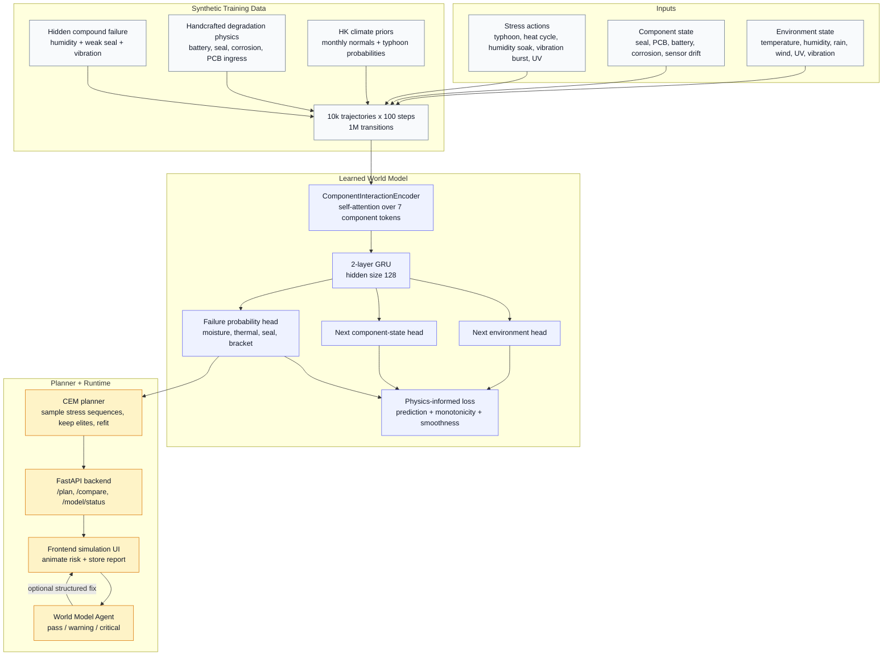

# Manu

**Manu for Smart City Nodes** is our EuroTech Hong Kong Hackathon project.

Track:

> **Smart City**

Goal:

> Win the Smart City track, then finish top 3 overall.

## One-Liner

> Manu turns dense-city problems into reviewable smart-city hardware briefs: deployment context, 3D node, component graph, BOM, hardware risk fix and Hong Kong/GBA supplier route.

## What We Are Building

Smart cities need thousands of physical devices, but the entry point is too hard:

- the idea is vague
- there is no hardware expert at the start
- there is no component map
- there is no deployment context
- there is no supplier-ready RFQ
- cost estimates are unreliable
- time-to-pilot is slow
- investors and operators struggle to understand the physical product from a slide or text file

Manu solves the first mile:

```text
Problem
-> Deployment Context
-> BOM + Sensor Graph
-> Hardware Risk
-> Apply Fix
-> 3D Smart City Node
-> X-Ray / Explode
-> GBA Supplier Route
```

It does **not** generate final CAD or replace hardware engineers. It creates the first reviewable hardware brief experts and suppliers can evaluate.

## Architecture

Manu is built as an interruptible multi-agent compiler, not as one giant prompt. The chat orchestrator keeps the conversation state, asks for missing context first, then delegates bounded work to specialist agents and local MCP servers.

```mermaid
flowchart LR
  User["Urban operator / founder<br/>dense-city problem"] --> Chat["Chat UI<br/>discreet tool trace"]
  Chat --> Gate{"Context Gate<br/>enough to build?"}

  Gate -->|missing context| Questions["Clarifying questions"]
  Questions --> Chat

  Gate -->|context ready| Orch["Orchestrator Agent<br/>state machine + checkpoints"]

  subgraph States["Conversation State"]
    direction TB
    S1["awaiting_context"]
    S2["context_ready"]
    S3["running_experts"]
    S4["awaiting_risk_decision"]
    S5["applying_fix"]
    S6["complete"]
    S1 --> S2 --> S3 --> S4 --> S5 --> S6
    S3 --> S6
  end

  Orch -.->|sets state| S1

  subgraph Experts["Specialist Agents"]
    direction TB
    Context["Context Agent<br/>DeploymentContext JSON"]
    Compliance["Hong Kong Compliance Agent"]
    Components["Component Agent<br/>catalog IDs only"]
    Hardware["Hardware Expert Agent"]
    BOM["BOM Agent<br/>deterministic pricing"]
    DFMA["DfMA Agent<br/>risk + fix pack"]
    Supplier["GBA Supplier Agent"]
    Scene["3D Scene Agent"]
    WorldModel["World Model Agent<br/>field-risk verdict"]
  end

  Orch --> Context --> Compliance --> Components --> Hardware --> BOM --> DFMA
  DFMA -->|critical risk| Stop["Risk checkpoint<br/>pause before RFQ / final 3D"]
  Stop --> Chat
  Chat -->|apply fix or user constraint| Orch
  DFMA -->|no blocker or fixed| Supplier --> Scene --> Output["Reviewable hardware brief<br/>3D node + X-Ray + BOM + RFQ route"]
  Output -->|run stress simulation| WorldModel
  WorldModel -->|pass / warning / critical| Chat
  Chat -->|apply world-model fix| Orch

  subgraph MCP["Local MCP Servers"]
    direction TB
    ComplianceMCP["compliance MCP<br/>HK rules + source URLs"]
    HardwareMCP["hardware MCP<br/>component library search + assembly patterns"]
    SupplierMCP["supplier MCP<br/>GBA routing + RFQ questions"]
    SceneMCP["scene MCP<br/>parametric scene graph"]
    ResearchMCP["source research MCP<br/>Tavily candidate updates"]
  end

  subgraph Simulation["World Model Runtime"]
    direction TB
    PlanAPI["/api/world-model/plan"]
    Backend["FastAPI world-model backend"]
    AnalyzeAPI["/api/world-model/analyze"]
  end

  Compliance -.->|search_requirements| ComplianceMCP
  Components -.->|recommend/search components| HardwareMCP
  Hardware -.->|match_assembly_pattern| HardwareMCP
  Supplier -.->|route_bom_to_gba| SupplierMCP
  Scene -.->|generate_scene_graph| SceneMCP
  WorldModel -.->|plan rollout| PlanAPI --> Backend --> AnalyzeAPI
  ComplianceMCP -.->|candidate updates| ResearchMCP
  HardwareMCP -.->|availability research| ResearchMCP

  subgraph Truth["Grounded Knowledge"]
    direction TB
    Catalog["component-catalog.json<br/>100+ smart-city components"]
    Selection["component-selection-rules.json<br/>data-driven intents"]
    Assembly["assembly-patterns.json"]
    Rules["compliance-rules.json<br/>dfma-rules.json"]
    Suppliers["supplier-graph.json"]
  end

  ComplianceMCP --> Rules
  HardwareMCP --> Catalog
  HardwareMCP --> Selection
  HardwareMCP --> Assembly
  Components --> Selection
  BOM --> Catalog
  DFMA --> Rules
  SupplierMCP --> Suppliers
  SceneMCP --> Catalog

  classDef user fill:#111827,stroke:#111827,color:#fff;
  classDef core fill:#2563eb,stroke:#1d4ed8,color:#fff;
  classDef agent fill:#eef2ff,stroke:#6366f1,color:#111827;
  classDef mcp fill:#ecfeff,stroke:#0891b2,color:#111827;
  classDef data fill:#f8fafc,stroke:#64748b,color:#111827;
  classDef warn fill:#fee2e2,stroke:#dc2626,color:#111827;
  classDef out fill:#dcfce7,stroke:#16a34a,color:#111827;
  classDef sim fill:#fef3c7,stroke:#d97706,color:#111827;

  class User,Chat user;
  class Gate,Orch core;
  class Context,Compliance,Components,Hardware,BOM,DFMA,Supplier,Scene,WorldModel agent;
  class ComplianceMCP,HardwareMCP,SupplierMCP,SceneMCP,ResearchMCP mcp;
  class Catalog,Selection,Assembly,Rules,Suppliers data;
  class Stop warn;
  class Output out;
  class PlanAPI,Backend,AnalyzeAPI sim;
```



Whiteboard version:

```text
User problem
  -> Context Gate
  -> Orchestrator state machine
  -> Context / Compliance / Component / Hardware / BOM / DfMA agents
  -> Component library selection from catalog + data-driven rules
  -> Risk checkpoint: ask user before continuing
  -> Supplier + 3D agents
  -> Reviewable hardware brief
  -> World Model stress simulation
  -> World Model verdict / optional structured fix

Each specialist calls only its allowed MCP:
Compliance MCP, Hardware MCP, Supplier MCP, Scene MCP, Source Research MCP.
```

What is real today:

- local stdio MCP servers exist for compliance, hardware, suppliers, source research and 3D scene generation
- agents have an allowlisted tool registry, so a supplier agent cannot call hardware tools by accident
- the Context Gate can stop the pipeline before expert calls if the prompt is too vague
- if the user delegates missing context (`jsp`, `fais comme tu veux`, `up to you`), the Context Gate uses an explicit Hong Kong dense-city default instead of repeating questions forever
- the Component Agent can select from a checked-in 100+ part smart-city library using data-driven selection rules, not prompt-specific object fixtures
- the Hardware MCP exposes component search, recommendation, lookup and assembly matching against the same library
- the DfMA checkpoint can interrupt the pipeline before supplier routing and final 3D output
- final 3D generation uses `scene.generate_scene_graph` through the local Scene MCP and is required by the orchestrator; it is not silently replaced by fake 3D boxes
- the World Model flow can run a field-risk simulation, analyze the report and feed a structured fix back into the pipeline
- Tavily is used only for candidate source updates; trusted generation still comes from checked-in, versioned knowledge files

## World Model Layer

The World Model is a learned stress-test layer for the BuildGuard demo object. It is separate from DfMA:

- **DfMA** catches deterministic manufacturability risks before the supplier/scene stages.
- **World Model** simulates field degradation over time, finds high-risk stress sequences and returns a verdict that can feed a structured fix back into the pipeline.

It is not certified structural analysis and it is not trained on live field failures. It is a hackathon-scale learned simulator trained on synthetic trajectories calibrated to plausible Hong Kong conditions.



How it is trained:

1. `backend/training.py` generates synthetic field trajectories. One timestep is one week, and the demo dataset uses `10,000 trajectories x 100 timesteps`.
2. The simulator is calibrated with public reference data: Hong Kong Observatory climate normals, public typhoon statistics, NASA PCoE battery degradation datasets, published UV/weathering references for seal materials, ISO-style corrosion categories and basic thermal-resistance models.
3. It samples Hong Kong-like climate conditions, typhoon weeks and stress actions, then applies handcrafted degradation rules for enclosure seal integrity, PCB health, battery state of health, corrosion and sensor drift.
4. The key hidden interaction is compound moisture ingress: high humidity plus degraded seal plus vibration produces non-linear PCB risk. Single-variable stress tests do not expose it well.
5. `backend/model.py` trains an attention-augmented GRU. Component self-attention summarizes interactions between seal, PCB, battery, corrosion and sensor drift before the GRU predicts the next state.
6. The loss combines prediction error with physics penalties: degradation should not spontaneously recover, corrosion should not decrease, and temperature jumps should stay physically plausible.
7. At runtime, the CEM planner searches for stress-action sequences that maximize failure probability and minimize time-to-failure.
8. The frontend calls `/api/world-model/plan`, animates the risk rollout, sends the resulting report to `/api/world-model/analyze`, and can apply a structured fix through `/api/world-model/apply-fix`.

Public calibration sources are used to shape the synthetic simulator, not to claim certified reliability. The claim is that the model can learn and search plausible degradation dynamics for a reviewable prototype brief.

Truth policy for the World Model:

- Do not invent calibration sources, field data, test results or validation studies.
- Only claim sources and mechanisms that are present in `backend/training.py`, `backend/model.py`, checked-in docs, or explicitly provided by the team.
- If a source is not in the codebase or team notes, describe it as future validation work, not as something already used.

The technical claim is narrow:

> We trained a learned degradation simulator on synthetic, physics-shaped trajectories so the demo can discover compound field-risk sequences and feed structured fixes back into the hardware brief.

## Demo Proof: BuildGuard Node

**BuildGuard Node is the proof of Manu, not the whole company.**

BuildGuard is a low-maintenance facade sensor node for aging Hong Kong residential buildings between Mandatory Building Inspection cycles.

Demo prompt:

```text
A 52-year-old Hong Kong residential building needs a low-maintenance facade sensor node that monitors crack propagation, vibration anomalies, tilt shifts and moisture ingress, and creates early warnings before the next Mandatory Building Inspection.
```

Manu turns this into:

- deployment context
- 3D BuildGuard Node
- X-Ray / Explode view
- component graph
- BOM v0
- weatherproofing risk
- Apply Fix update
- RFQ questions
- Hong Kong/GBA supplier route

Killer line:

> Mandatory inspection tells you what is wrong every 10 years. BuildGuard tells you what is changing between inspections.

## Why Hong Kong / GBA

Hong Kong is the trusted front door:

- dense city testbed
- aging residential buildings
- smart-city operators and programs
- property managers, inspectors and building rehabilitation stakeholders

GBA is the manufacturing engine:

- Shenzhen electronics
- Dongguan enclosures and metal partners
- Hong Kong / Guangzhou compliance and logistics

## Deliverables

Hackathon deliverables:

- GitHub repository
- 2-minute business video
- 2-minute technical demo video

## Docs

Read:

- [`docs/README.md`](docs/README.md)
- [`docs/product-brief.md`](docs/product-brief.md)
- [`docs/buildguard-node.md`](docs/buildguard-node.md)
- [`docs/demo-and-build-plan.md`](docs/demo-and-build-plan.md)
- [`docs/agent-prompt.md`](docs/agent-prompt.md)
- [`docs/runtime-and-defaults-audit.md`](docs/runtime-and-defaults-audit.md)

## Guardrails

Do not claim:

- final CAD
- certified structural safety
- replacement of Registered Inspectors
- live supplier quotes
- full marketplace in 48 hours
- arbitrary hardware generation

Say instead:

> Manu creates the first reviewable hardware brief: deployment context, 3D node, BOM, risk map, RFQ and supplier route.
