# Physical Cursor

**Physical Cursor for Smart City Nodes** is our EuroTech Hong Kong Hackathon project.

Track:

> **Smart City**

Goal:

> Win the Smart City track, then finish top 3 overall.

## One-Liner

> Physical Cursor turns dense-city problems into reviewable smart-city hardware briefs: deployment context, 3D node, component graph, BOM, hardware risk fix and Hong Kong/GBA supplier route.

## What We Are Building

Smart cities need thousands of physical devices, but the entry point is too hard:

- the idea is vague
- there is no hardware expert at the start
- there is no component map
- there is no deployment context
- there is no supplier-ready RFQ
- cost estimates are unreliable
- time-to-pilot is slow
- investors and operators struggle to understand the physical product from a slide or text file

Physical Cursor solves the first mile:

```text
Problem
-> Deployment Context
-> 3D Smart City Node
-> X-Ray / Explode
-> BOM + Sensor Graph
-> Hardware Risk
-> Apply Fix
-> GBA Supplier Route
```

It does **not** generate final CAD or replace hardware engineers. It creates the first reviewable hardware brief experts and suppliers can evaluate.

## Architecture

Physical Cursor is built as an interruptible multi-agent compiler, not as one giant prompt. The chat orchestrator keeps the conversation state, asks for missing context first, then delegates bounded work to specialist agents and local MCP servers.

```mermaid
flowchart LR
  User["Urban operator / founder<br/>dense-city problem"] --> Chat["Chat UI<br/>discreet tool trace"]
  Chat --> Gate{"Context Gate<br/>enough to build?"}

  Gate -->|missing context| Questions["Clarifying questions"]
  Questions --> Chat

  Gate -->|context ready| Orch["Orchestrator Agent<br/>state machine + checkpoints"]

  subgraph States["Conversation State"]
    direction TB
    S1["awaiting_context"]
    S2["context_ready"]
    S3["running_experts"]
    S4["awaiting_risk_decision"]
    S5["applying_fix"]
    S6["complete"]
    S1 --> S2 --> S3 --> S4 --> S5 --> S6
    S3 --> S6
  end

  Orch -.->|sets state| S1

  subgraph Experts["Specialist Agents"]
    direction TB
    Context["Context Agent<br/>DeploymentContext JSON"]
    Compliance["Hong Kong Compliance Agent"]
    Components["Component Agent<br/>catalog IDs only"]
    Hardware["Hardware Expert Agent"]
    BOM["BOM Agent<br/>deterministic pricing"]
    DFMA["DfMA Agent<br/>risk + fix pack"]
    Supplier["GBA Supplier Agent"]
    Scene["3D Scene Agent"]
  end

  Orch --> Context --> Compliance --> Components --> Hardware --> BOM --> DFMA
  DFMA -->|critical risk| Stop["Risk checkpoint<br/>pause before RFQ / final 3D"]
  Stop --> Chat
  Chat -->|apply fix or user constraint| Orch
  DFMA -->|no blocker or fixed| Supplier --> Scene --> Output["Reviewable hardware brief<br/>3D node + X-Ray + BOM + RFQ route"]

  subgraph MCP["Local MCP Servers"]
    direction TB
    ComplianceMCP["compliance MCP<br/>HK rules + source URLs"]
    HardwareMCP["hardware MCP<br/>assembly patterns + component search"]
    SupplierMCP["supplier MCP<br/>GBA routing + RFQ questions"]
    SceneMCP["scene MCP<br/>parametric scene graph"]
    ResearchMCP["source research MCP<br/>Tavily candidate updates"]
  end

  Compliance -.->|search_requirements| ComplianceMCP
  Hardware -.->|match_assembly_pattern| HardwareMCP
  Supplier -.->|route_bom_to_gba| SupplierMCP
  Scene -.->|generate_scene_graph| SceneMCP
  ComplianceMCP -.->|candidate updates| ResearchMCP
  HardwareMCP -.->|availability research| ResearchMCP

  subgraph Truth["Grounded Knowledge"]
    direction TB
    Catalog["component-catalog.json"]
    Assembly["assembly-patterns.json"]
    Rules["compliance-rules.json<br/>dfma-rules.json"]
    Suppliers["supplier-graph.json"]
  end

  ComplianceMCP --> Rules
  HardwareMCP --> Catalog
  HardwareMCP --> Assembly
  BOM --> Catalog
  DFMA --> Rules
  SupplierMCP --> Suppliers
  SceneMCP --> Catalog

  classDef user fill:#111827,stroke:#111827,color:#fff;
  classDef core fill:#2563eb,stroke:#1d4ed8,color:#fff;
  classDef agent fill:#eef2ff,stroke:#6366f1,color:#111827;
  classDef mcp fill:#ecfeff,stroke:#0891b2,color:#111827;
  classDef data fill:#f8fafc,stroke:#64748b,color:#111827;
  classDef warn fill:#fee2e2,stroke:#dc2626,color:#111827;
  classDef out fill:#dcfce7,stroke:#16a34a,color:#111827;

  class User,Chat user;
  class Gate,Orch core;
  class Context,Compliance,Components,Hardware,BOM,DFMA,Supplier,Scene agent;
  class ComplianceMCP,HardwareMCP,SupplierMCP,SceneMCP,ResearchMCP mcp;
  class Catalog,Assembly,Rules,Suppliers data;
  class Stop warn;
  class Output out;
```



Whiteboard version:

```text
User problem
  -> Context Gate
  -> Orchestrator state machine
  -> Context / Compliance / Component / Hardware / BOM / DfMA agents
  -> Risk checkpoint: ask user before continuing
  -> Supplier + 3D agents
  -> Reviewable hardware brief

Each specialist calls only its allowed MCP:
Compliance MCP, Hardware MCP, Supplier MCP, Scene MCP, Source Research MCP.
```

What is real today:

- local stdio MCP servers exist for compliance, hardware, suppliers, source research and 3D scene generation
- agents have an allowlisted tool registry, so a supplier agent cannot call hardware tools by accident
- the Context Gate can stop the pipeline before expert calls if the prompt is too vague
- the DfMA checkpoint can interrupt the pipeline before supplier routing and final 3D output
- Tavily is used only for candidate source updates; trusted generation still comes from checked-in, versioned knowledge files

## Demo Proof: BuildGuard Node

**BuildGuard Node is the proof of Physical Cursor, not the whole company.**

BuildGuard is a low-maintenance facade sensor node for aging Hong Kong residential buildings between Mandatory Building Inspection cycles.

Demo prompt:

```text
A 52-year-old Hong Kong residential building needs a low-maintenance facade sensor node that monitors crack propagation, vibration anomalies, tilt shifts and moisture ingress, and creates early warnings before the next Mandatory Building Inspection.
```

Physical Cursor turns this into:

- deployment context
- 3D BuildGuard Node
- X-Ray / Explode view
- component graph
- BOM v0
- weatherproofing risk
- Apply Fix update
- RFQ questions
- Hong Kong/GBA supplier route

Killer line:

> Mandatory inspection tells you what is wrong every 10 years. BuildGuard tells you what is changing between inspections.

## Why Hong Kong / GBA

Hong Kong is the trusted front door:

- dense city testbed
- aging residential buildings
- smart-city operators and programs
- property managers, inspectors and building rehabilitation stakeholders

GBA is the manufacturing engine:

- Shenzhen electronics
- Dongguan enclosures and metal partners
- Hong Kong / Guangzhou compliance and logistics

## Deliverables

Hackathon deliverables:

- GitHub repository
- 2-minute business video
- 2-minute technical demo video

## Docs

Read:

- [`docs/README.md`](docs/README.md)
- [`docs/product-brief.md`](docs/product-brief.md)
- [`docs/buildguard-node.md`](docs/buildguard-node.md)
- [`docs/demo-and-build-plan.md`](docs/demo-and-build-plan.md)
- [`docs/agent-prompt.md`](docs/agent-prompt.md)

## Guardrails

Do not claim:

- final CAD
- certified structural safety
- replacement of Registered Inspectors
- live supplier quotes
- full marketplace in 48 hours
- arbitrary hardware generation

Say instead:

> Physical Cursor creates the first reviewable hardware brief: deployment context, 3D node, BOM, risk map, RFQ and supplier route.
