# Physical Cursor Frontend

Next.js frontend for **Physical Cursor for Smart City Nodes**.

This is not a generic create-next-app demo. It is the hackathon workspace that turns a dense-city problem into a reviewable smart-city hardware brief, then makes the brief explorable in 3D, testable through a world model, and actionable as a procurement Build Pack.

---

## Run

```bash
npm install
npm run dev
```

Open:

```text
http://localhost:3000
```

Production checks:

```bash
npm run test
npm run lint
npm run build
```

---

## Environment

Optional:

```bash
OPENAI_API_KEY=...
OPENAI_MODEL=gpt-4.1-mini
TAVILY_API_KEY=...
WORLD_MODEL_API_URL=http://127.0.0.1:8000
```

Behavior:

- Without `OPENAI_API_KEY`, Context Agent, Component Agent and chat intent classification fall back to deterministic parsers/rules where supported.
- Without `TAVILY_API_KEY`, source-refresh tools return `not_configured` and do not pretend live research happened.
- Without `WORLD_MODEL_API_URL`, `/api/world-model/plan` targets `http://127.0.0.1:8000`.
- Scene generation still uses the local Scene MCP server for catalog-only designs; designs with unverified extra components use the in-process scene resolver so the new parts can render.

---

## Product Surfaces

| Route | Role |
|---|---|
| `/` | Redirects to the demo workspace using `DEMO_PROJECT_ID`. |
| `/project/[id]` | Context entry form. Resets the project store for a fresh prompt. |
| `/project/[id]/workspace` | Main cockpit: chat, expert trace, BOM, 3D node, DfMA checkpoint, world-model simulation and exports. |
| `/project/[id]/marketplace` | Build Pack marketplace: procurement readiness, grouped kit, buy-link funnel, RFQ export, supplier route and source refresh. |
| `/api/*` | App Router API layer for context analysis, pipeline streaming, edits/fixes, world-model bridge, marketplace redirects and source refresh. |
| `mcp/*.mjs` | Local MCP stdio tools used by the pipeline and research refresh routes. |

`app/page.tsx` redirects directly to the demo workspace. The normal user journey still starts from `/project/[id]` when a new prompt is captured.

---

## Architecture

The app has one main source of truth: `PipelineState` from `lib/pipeline/types.ts`. The pipeline produces it, `hydrateStoreFromPipeline` projects it into UI-friendly Zustand fields, and later flows reuse the same state instead of inventing separate marketplace or world-model data.

```mermaid
flowchart LR
  User[User prompt / files] --> Entry[ContextEntryForm or Workspace chat]
  Entry --> Store[Zustand project store]
  Store --> Client[lib/pipeline-client.ts]

  Client --> GateAPI["POST /api/context/analyze"]
  GateAPI --> Gate["Context Gate\nLLM wrapper or deterministic gate"]
  Gate -->|needs_input| Store
  Gate -->|ready canonicalPrompt| StreamAPI["POST /api/pipeline/generate\nSSE stage events"]

  StreamAPI --> Orch[Pipeline Orchestrator]
  Orch --> Runtime[Agent Runtime\ntrace + tool allowlist]
  Runtime --> ContextAgent[Context Agent]
  Runtime --> Compliance["Compliance MCP\nsearch_requirements"]
  Runtime --> ComponentAgent[Component Agent]
  Runtime --> Hardware["Hardware MCP\nmatch_assembly_pattern"]
  Runtime --> Bom[BOM Resolver]
  Runtime --> Dfma[DfMA Engine]
  Dfma -->|critical warning| RiskCheckpoint[Risk Checkpoint]
  RiskCheckpoint --> WarningCard[Chat Warning Card]
  WarningCard --> FixAPI["POST /api/pipeline/apply-fix"]
  FixAPI --> ReResolve[Re-resolve components downstream]
  Dfma -->|no blocking risk| Supplier["Supplier MCP\nroute_bom_to_gba"]
  ReResolve --> Supplier
  Supplier --> Scene["Scene MCP or in-process scene resolver"]
  Scene --> PipelineState[PipelineState complete]

  PipelineState --> Hydrate[hydrateStoreFromPipeline]
  Hydrate --> Left[Left panel\ncontext, BOM, suppliers, sources]
  Hydrate --> Center[Center panel\n3D BuildGuard node + reports]
  Hydrate --> Right[Right panel\nchat, tool trace, cards]
  Hydrate --> Header[Header export + Build Pack link]

  Right --> IntentAPI["POST /api/chat/intent"]
  IntentAPI -->|edit| EditAPI["POST /api/pipeline/edit"]
  EditAPI --> ReResolve

  Center --> PlanAPI["POST /api/world-model/plan"]
  PlanAPI --> Backend["FastAPI world-model backend\n../backend, auto-started by uvicorn"]
  Backend --> SimulationReport[SimulationReport]
  SimulationReport --> AnalyzeAPI["POST /api/world-model/analyze"]
  AnalyzeAPI --> WMAgent[Deterministic World Model Agent]
  WMAgent --> Verdict[WorldModelVerdict card]
  Verdict --> WMFixAPI["POST /api/world-model/apply-fix"]
  WMFixAPI --> ReResolve

  Header --> Marketplace["/project/[id]/marketplace"]
  Marketplace --> BuildPack[deriveBuildPack]
  BuildPack --> Exports[PDF readiness pack\nBOM CSV\nDesign JSON]
  BuildPack --> GoAPI["GET /api/go\nallowlisted redirect + click log"]
  BuildPack --> RefreshAPI["POST /api/research/refresh"]
  RefreshAPI --> ComplianceRefresh["Compliance MCP\nrefresh_sources"]
  RefreshAPI --> HardwareRefresh["Hardware MCP\nresearch_component_availability"]
```



### Runtime Flow

1. The user enters a smart-city hardware need in `ContextEntryForm` or the workspace chat.
2. `lib/pipeline-client.ts` sends the prompt to `/api/context/analyze`.
3. The Context Gate either asks targeted clarification questions or returns a canonical prompt.
4. `/api/pipeline/generate` streams Server-Sent Events from `runPipeline(..., { interruptOnRisk: true })`.
5. The orchestrator runs context extraction, compliance lookup, component selection, assembly validation, BOM resolution and DfMA.
6. If a critical DfMA warning exists, the pipeline returns `pipelineStatus: 'awaiting_risk_decision'` and emits `stage:checkpoint:risk`.
7. The UI stores the partial `PipelineState`, renders a `WarningCard`, and waits for the user to apply the proposed fix.
8. `/api/pipeline/apply-fix` adds the fix components, then re-runs assembly, BOM, DfMA, RFQ and scene.
9. Supplier and scene stages complete the `PipelineState`, which is hydrated into panels, 3D scene data, exports and marketplace inputs.
10. Follow-up chat turns are classified by `/api/chat/intent`; component edits go through `/api/pipeline/edit` and re-resolve downstream state.
11. The world model can run after a scene exists; the resulting report is analyzed into a typed verdict and can trigger another pipeline re-resolution.
12. The marketplace derives a Build Pack from current store state and `PipelineState`.

The legacy `/api/chat` route is not the source of truth for the workspace pipeline.

---

## Agents, Tools and Fallbacks

| Stage | Code owner | Tooling | Fallback policy |
|---|---|---|---|
| Context Gate | `lib/context-gate.ts`, `lib/context-gate-server.ts` | OpenAI JSON agent when configured | Local `evaluateContextGate` and normalization. |
| Context Agent | `lib/pipeline/context-agent.ts`, `lib/pipeline/parse-context.ts` | OpenAI when configured | Deterministic prompt parser. |
| Compliance Agent | `lib/pipeline/compliance-resolver.ts`, `mcp/compliance-server.mjs` | `compliance.search_requirements` | In-process resolver from `data/compliance-rules.json`. |
| Component Agent | `lib/pipeline/component-agent.ts`, `lib/pipeline/inclusion-rules.ts` | OpenAI may propose catalog IDs plus extra candidate parts | Rule-based catalog selection. |
| Hardware Expert Agent | `lib/pipeline/assembly-resolver.ts`, `mcp/hardware-server.mjs` | `hardware.match_assembly_pattern` | In-process assembly-pattern resolver. |
| BOM Agent | `lib/pipeline/bom-resolver.ts` | Local catalog and registry resolution | No LLM prices; values come from checked-in data or candidate edit estimates. |
| DfMA Agent | `lib/pipeline/dfma-engine.ts` | Local rules from `data/dfma-rules.json` | Deterministic only. |
| Supplier GBA Agent | `lib/pipeline/rfq-agent.ts`, `mcp/supplier-server.mjs` | `supplier.route_bom_to_gba` | Deterministic RFQ and route builder from `data/supplier-graph.json`. |
| Scene 3D Agent | `lib/pipeline/scene-resolver.ts`, `mcp/scene-server.mjs` | `scene.generate_scene_graph` is required for catalog-only designs | Non-catalog edit designs resolve in-process so extra components render. |
| World Model Agent | `lib/world-model/agent.ts` | Deterministic analyzer over `SimulationReport` | Always returns `pass`, `warning` or `critical` for valid reports. |

`lib/pipeline/agent-runtime.ts` records `agentTrace`, `mcpToolCalls`, required-vs-fallback tool calls and enforces the allowlist in `lib/pipeline/agent-registry.ts`.

---

## Pipeline State Contract

`PipelineState` is the contract between APIs, UI, marketplace, world model and exports.

Core fields:

- `deploymentContext`: city, site, mounting, environment, power, connectivity, privacy and goal.
- `compliance`: matched requirements with source status and update strategy.
- `componentGraph`: node type and selected component IDs.
- `assembly`: matched pattern, missing required parts, constraints and assembly steps.
- `bom`: rows, total cost, sourcing metadata, manufacturer/MPN/offers where known.
- `dfma`: warnings, passed checks and structured fix packs.
- `rfq`: supplier questions and GBA or generic supplier route.
- `scene`: component-to-scene node graph with placement, parent anchors and geometry.
- `extraComponents`: unverified LLM/chat-proposed components kept in the merged working catalog.
- `baselineComponentIds` and `baselineBomTotal`: used to show fix deltas and marketplace readiness.
- `mcpToolCalls` and `agentTrace`: audit trail shown in chat and expert panels.
- `pipelineStatus` and `interruption`: checkpoint control for blocking DfMA risks.

`lib/pipeline/hydrate-store.ts` maps `PipelineState` into `lib/store.ts`:

- left panel fields: context, BOM, RFQ questions, supplier route and source status
- center panel fields: scene components, current demo step, show/hide 3D node and simulation reports
- right panel fields: active warning, tool-call cards, world-model verdicts and chat actions
- header/marketplace/export fields: project title, current pipeline state, BOM totals and Build Pack availability

---

## Build Pack Marketplace

The completed workspace can open a procurement view:

```text
/project/[id]/marketplace
```

The marketplace is a Build Pack page. It turns the current store and pipeline output into:

- procurement readiness score and blocking flags
- grouped BOM contents: sensors, compute/connectivity, power, enclosure/mechanical and other
- MPN, manufacturer, lifecycle, source status and best distributor offer where available
- buy links wrapped through `/api/go`
- RFQ questions and supplier-route handoff
- source refresh through `/api/research/refresh`
- exports for readiness pack PDF, BOM CSV and design artifact JSON

This is not a fake checkout. The UI does not invent stock, live pricing, delivery dates or verified supplier guarantees.

### Sourcing Truth Policy

- `verified`: live or manually reviewed source
- `seeded`: curated catalog / registry source; price remains an estimate
- `candidate`: candidate result or estimate requiring confirmation
- `not_configured`: live source refresh is unavailable
- `error`: lookup failed; confirm before purchase

The checked-in component catalog now covers 100+ smart-city parts. BuildGuard is one catalog-backed graph, not a special runtime fixture. Source status remains explicit: `verified` entries have registry-backed source data, `seeded` entries are curated concept-stage assumptions, and `candidate` entries are agent/user proposals that require confirmation before RFQ.

`/api/go` owns the marketplace redirect funnel. It allowlists known distributor hosts, tags outbound links, and logs clicks to `data/_marketplace-clicks.jsonl` without blocking the redirect.

`/api/research/refresh` calls compliance and hardware source tools in parallel. Without `TAVILY_API_KEY`, refresh reports `not_configured` and the marketplace keeps using seeded sources.

---

## World Model Agent

The world model is not only an animation. After `/api/world-model/plan` returns rollout steps, the frontend stores a `SimulationReport`, animates the 3D node, and calls `/api/world-model/analyze`.

The analyzer is deterministic in v1. It reads peak device risk, dominant failure heads, per-component risk and active stress action, then returns a typed verdict:

- `pass`: no hardware change required.
- `warning`: field hardening recommended.
- `critical`: build should be blocked until resilience fix is applied.

DfMA warnings and World Model verdicts are intentionally separate:

- DfMA catches manufacturability risks before production.
- World Model catches simulated field failures over time.

Fixes are applied through the existing pipeline. If a verdict maps to an existing DfMA fix, the app reuses `applyPipelineFix`; otherwise it applies a structured component edit and regenerates BOM, sourcing, RFQ and scene.

Local backend expectation:

- `/api/world-model/plan` proxies to the FastAPI backend in `../backend`.
- If `WORLD_MODEL_API_URL` is unset, the frontend targets `http://127.0.0.1:8000`.
- The route auto-starts `uv run uvicorn main:app --host 0.0.0.0 --port 8000` from `../backend` when needed.

---

## Data Sources

Checked-in data is intentionally part of the product:

| File | Used by |
|---|---|
| `data/component-catalog.json` | Component selection, BOM, scene and DfMA. |
| `data/component-selection-rules.json` | Data-driven intent rules for deterministic catalog selection. |
| `data/parts-registry.json` | MPN, manufacturer, lifecycle, datasheet and distributor offers. |
| `data/supplier-graph.json` | GBA/generic supplier route and RFQ templates. |
| `data/assembly-patterns.json` | Hardware assembly matching and missing required component checks. |
| `data/dfma-rules.json` | Critical/warning/note manufacturability checks and fix packs. |
| `data/compliance-rules.json` | Seeded compliance requirements and source metadata. |

Candidate web research never mutates these files automatically. It is surfaced as candidate evidence so a human can decide what to trust.

---

## Key Files

| File | Role |
|---|---|
| `app/project/[id]/workspace/page.tsx` | Main client workspace, demo loading, world-model action bridge and chat submit handler. |
| `app/project/[id]/marketplace/page.tsx` | App Router entry for the Build Pack page. |
| `components/left/*` | Context, pipeline stages, BOM, suppliers and expert-source panels. |
| `components/center/BuildGuardNode.tsx` | 3D node renderer, procedural scene details and risk recoloring. |
| `components/center/SimulationOverlay.tsx` | World-model scenario controls. |
| `components/center/SimulationReportsPanel.tsx` | Stored telemetry reports and failure-head charts. |
| `components/right/*` | Chat feed, input, DfMA warning cards and world-model verdict cards. |
| `components/marketplace/*` | Build Pack header, procurement actions, kit contents, supplier route and RFQ panel. |
| `components/ui/Header.tsx` | Workspace header, export menu and marketplace CTA. |
| `lib/store.ts` | Zustand project store for chat, pipeline, scene, sourcing and simulation state. |
| `lib/pipeline-client.ts` | Single chat entrypoint: context gate, streaming generation, checkpoint handling and follow-up routing. |
| `lib/pipeline-stream.ts` | Fetch helpers for streaming pipeline, fixes, edits and world-model endpoints. |
| `lib/pipeline/orchestrator.ts` | Pipeline state machine, risk checkpoint, DfMA fix and component-edit re-resolution. |
| `lib/pipeline/agent-runtime.ts` | Agent trace, MCP calls, required-vs-fallback policy and tool allowlist enforcement. |
| `lib/pipeline/agent-registry.ts` | Agent and MCP tool registry. |
| `lib/pipeline/to-ui.ts` | Converts pipeline objects to UI-ready context, BOM, scene and warnings. |
| `lib/pipeline/hydrate-store.ts` | Projects `PipelineState` into the Zustand store. |
| `lib/marketplace/build-pack.ts` | Derives readiness score, grouped kit lines, actions and warnings from store data. |
| `lib/world-model-simulation.ts` | Calls `/api/world-model/plan`, animates risk over time, stores reports and triggers verdict analysis. |
| `lib/world-model/agent.ts` | Deterministic field-risk analyzer and recommended action mapper. |
| `lib/export.ts` | Readiness PDF, BOM CSV and design JSON export generation. |
| `lib/mcp/client.ts` | Spawns local MCP stdio servers per tool call and parses structured results. |
| `lib/scene/part-details.ts` | Procedural visual detail layer for the 3D node. |
| `mcp/*.mjs` | Local MCP servers for compliance, hardware, supplier, scene and source research. |

---

## API Map

| Route | Method | Role |
|---|---:|---|
| `/api/context/analyze` | `POST` | Runs Context Gate and returns `ready` or targeted questions. |
| `/api/pipeline/generate` | `POST` | Streams pipeline stage events as SSE and interrupts on critical DfMA risk. |
| `/api/pipeline/fallback` | `POST` | Runs deterministic pipeline when streaming fails. |
| `/api/pipeline/apply-fix` | `POST` | Applies a DfMA fix and re-runs downstream stages. |
| `/api/pipeline/edit` | `POST` | Applies chat-driven component edits and re-runs downstream stages. |
| `/api/chat/intent` | `POST` | Classifies follow-up chat into `chat`, `edit` or new `generate`. |
| `/api/chat` | `POST` | Legacy route; not the workspace source of truth. |
| `/api/fix` | `POST` | Legacy fix lookup route; modern workspace fixes use `/api/pipeline/apply-fix`. |
| `/api/world-model/plan` | `POST` | Ensures/proxies the FastAPI world-model backend and returns rollout steps. |
| `/api/world-model/analyze` | `POST` | Converts a simulation report into a deterministic verdict. |
| `/api/world-model/apply-fix` | `POST` | Applies verdict fix through the existing pipeline. |
| `/api/research/refresh` | `POST` | Calls compliance and hardware MCP research tools for candidate source updates. |
| `/api/go` | `GET` | Allowlisted outbound marketplace redirect with tracking tag and click log. |
| `/api/demo-project` | `GET` | Builds deterministic demo `PipelineState` from `demo-object.json`. |

---

## Hardcode Policy

There are intentional constants and data fixtures:

- demo prompt button in `components/project/ContextEntryForm.tsx`
- delegated Hong Kong dense-city default in `lib/context-gate.ts`
- checked-in catalog/supplier/rule JSON under `data/`
- procedural 3D detail primitives in `lib/scene/part-details.ts`
- deterministic demo state loading through `/api/demo-project`

These are documented in:

```text
../docs/runtime-and-defaults-audit.md
```

Do not add:

- hidden full-pipeline fallback JSON
- LLM-invented component IDs without `extraComponents` / candidate sourcing metadata
- LLM-invented prices as verified values
- LLM-invented suppliers
- silent fake 3D fallback if required Scene MCP fails
- source refresh that silently writes trusted data without human review

---

## Demo Prompt

```text
A 52-year-old Hong Kong residential building needs a low-maintenance facade sensor node that monitors crack propagation, vibration anomalies, tilt shifts and moisture ingress, and creates early warnings before the next Mandatory Building Inspection.
```

## Pitch Judging Criteria

Submission format:

- 2-minute business video.
- 2-minute technical deep-dive video.
- First finalist-selection pitch: 2 minutes live in front of the jury.

Live pitch emphasis:

- Do not spend 30 seconds on technical details.
- Assume the jury is not deeply technical.
- Lead with business value, Hong Kong relevance, feasibility, and demo clarity.

Scoring grid:

| Criterion | Points |
|---|---:|
| Innovation | 20 |
| Impact and Scalability | 20 |
| Feasibility | 15 |
| Hong Kong Alignment | 15 |
| Presentation | 10 |

Expected flow:

1. Context Gate returns `ready`.
2. Pipeline runs context/compliance/components/assembly/BOM/DfMA.
3. DfMA emits `IP_INSUFFICIENT`.
4. UI pauses at risk checkpoint.
5. User applies DfMA fix.
6. Supplier MCP and Scene MCP run.
7. 3D scene appears with assembly metadata and fix details.
8. User runs World Model simulation.
9. Reports tab captures telemetry.
10. World Model Agent posts verdict card in chat.
11. User applies resilience fix if recommended.
12. User reruns simulation to compare field risk.
13. User opens Build Pack Marketplace for procurement readiness, RFQ and buy-link handoff.

---

## Tests

Important targeted tests:

```bash
npm run test -- __tests__/context-gate.test.ts __tests__/pipeline-client-gate.test.ts
npm run test -- __tests__/pipeline.test.ts __tests__/agent-runtime.test.ts __tests__/mcp-servers.test.ts
npm run test -- __tests__/api-fix.test.ts __tests__/api-chat.test.ts __tests__/api-context-analyze.test.ts
npm run test -- __tests__/scene-agent.test.ts __tests__/scene-assembly.test.ts __tests__/scene-physics.test.ts
npm run test -- __tests__/world-model-agent.test.ts __tests__/world-model-api.test.ts __tests__/pipeline-stream-world-model.test.ts __tests__/world-model-verdict-card.test.tsx __tests__/world-model-simulation.test.ts
npm run test -- __tests__/marketplace-build-pack.test.ts __tests__/marketplace-page.test.tsx __tests__/header-build-pack-link.test.tsx __tests__/api-refresh.test.ts
```

Full verification:

```bash
npm run test
npm run lint
npm run build
```
